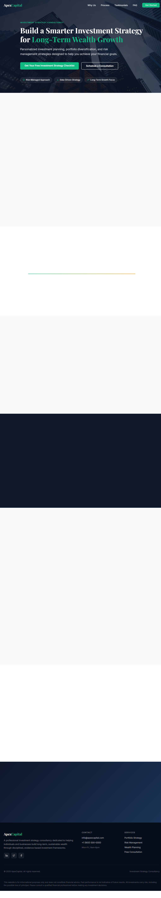

# ApexCapital — Investment Strategy Consultancy

A single-file static landing page for ApexCapital, an investment strategy consultancy. No build step, no bundler, no dependencies — just open `index.html` in a browser.



## Running locally

```
# Windows
start index.html

# macOS
open index.html

# Linux
xdg-open index.html
```

## Structure

Everything lives in `index.html`:

- **`<head>`** — meta/SEO tags (title, description, robots, canonical), Open Graph, Twitter Card, JSON-LD structured data (WebSite + FinancialService + FAQPage), Google Fonts (Inter + Playfair Display), all CSS in one `<style>` block
- **Sections** (in order): Nav → Hero → Why Choose Us → Investment Process → Testimonials → Lead Magnet → Enquiry Form → FAQ → Final CTA → Footer
- **`<script>`** — sticky nav, hamburger menu, smooth scroll, scroll-in animations (IntersectionObserver), FAQ accordion, form validation + fetch-based submission with a `SpeechSynthesis` voice confirmation post-hook, WhatsApp widget
- **WhatsApp widget** — fixed FAB (bottom-right) that opens a popup with 5 pre-filled query chips linking to `wa.me`

## External dependencies

| Resource | Purpose |
|---|---|
| `fonts.googleapis.com` | Inter + Playfair Display fonts |
| `images.unsplash.com` | Hero background image |
| `formsubmit.co` | Form submission backend |

All icons are inline SVG — no icon library required.

## Deployment

The site is deployed via GitHub Pages using branch-based deployment. Any push to `main` updates the live site.

## Customisation

- **Colours** — edit the CSS variables in `:root` at the top of the `<style>` block
- **Form recipient** — update the `action` attribute on `#enquiryForm` (currently posts to `formsubmit.co`)
- **Scroll animations** — add the `animate` class to any element; the IntersectionObserver handles the rest
- **Breakpoints** — `768px` (tablet), `480px` (mobile)
